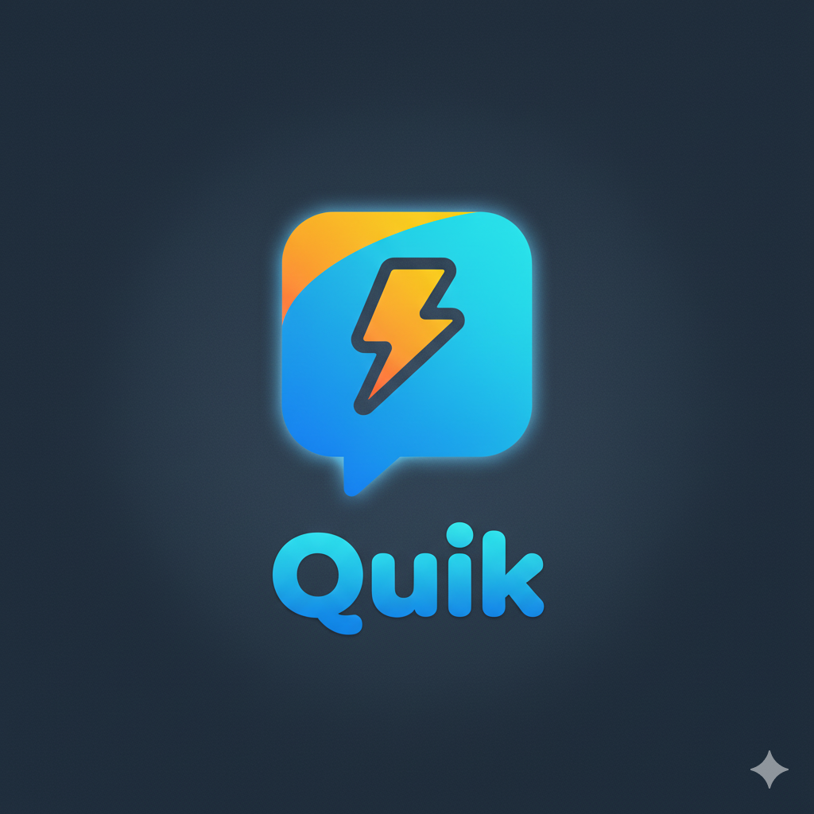

  

  # Quik

  **Kết nối nhanh hơn. Trò chuyện gần nhau hơn.**

  Quik là nền tảng mạng xã hội thời gian thực kết hợp nhắn tin, gọi thoại/video,
  chia sẻ nội dung và trợ lý AI trong một trải nghiệm thống nhất.

  [Trải nghiệm Quik](https://quik.id.vn)

---

## Về Quik

Quik được xây dựng để mọi người có thể kết nối, trò chuyện và chia sẻ những khoảnh khắc hằng ngày một cách nhanh chóng. Sản phẩm kết hợp các tính năng của ứng dụng nhắn tin và mạng xã hội, đồng thời bổ sung công cụ AI, quản lý quyền riêng tư và hệ thống quản trị tập trung.

Giao diện của Quik hỗ trợ cả máy tính và thiết bị di động, hướng đến trải nghiệm trực quan, liền mạch và nhất quán trong mọi hoạt động — từ một cuộc trò chuyện riêng tư đến việc khám phá nội dung trên bảng tin.

## Trải nghiệm nổi bật

### Nhắn tin thời gian thực

Gửi và nhận tin nhắn tức thì, chia sẻ hình ảnh, video, tệp và tin nhắn thoại. Quik hỗ trợ trạng thái hoạt động, phản hồi hội thoại và trải nghiệm đa phương tiện ngay trong phòng chat.

### Gọi thoại và video

Thực hiện cuộc gọi trực tiếp từ cuộc trò chuyện với trải nghiệm liền mạch, giúp người dùng chuyển từ nhắn tin sang trao đổi bằng giọng nói hoặc hình ảnh mà không làm gián đoạn kết nối.

### Bảng tin xã hội

Đăng tải nội dung, chia sẻ khoảnh khắc, tương tác bằng lượt thích và bình luận, theo dõi chủ đề thịnh hành và khám phá những kết nối mới trong cộng đồng.

### Bạn bè và thông báo

Tìm kiếm người dùng, gửi lời mời kết bạn, theo dõi trạng thái trực tuyến và nhận thông báo về những tương tác quan trọng theo thời gian thực.

### Trợ lý AI

Trợ lý AI được tích hợp trực tiếp vào Quik để hỗ trợ hội thoại, giải đáp câu hỏi và xử lý nội dung theo ngữ cảnh, giúp trải nghiệm giao tiếp trở nên nhanh chóng và tiện lợi hơn.

### Gói thành viên

Hệ thống thành viên Free, Lite, Pro và Max cung cấp các hạn mức và quyền lợi khác nhau, phù hợp với nhiều nhu cầu sử dụng.

### Quản trị hệ thống

Khu vực quản trị hỗ trợ theo dõi hoạt động, quản lý người dùng và phòng chat, phân quyền, xử lý báo cáo, phát thông báo và vận hành chế độ bảo trì.

## Nền tảng công nghệ

Quik sử dụng React và Zustand cho trải nghiệm phía người dùng; Node.js và Express cho hệ thống API; Firebase cho dữ liệu thời gian thực; Cloudflare R2 cho lưu trữ nội dung; Stringee cho cuộc gọi thoại/video; cùng các dịch vụ AI và xử lý giọng nói để mở rộng khả năng tương tác.

## Liên kết

- [Quik](https://quik.id.vn)
- [Backend API](https://github.com/huysg136/chat-realtime-api)

---

  Made for meaningful connections.

